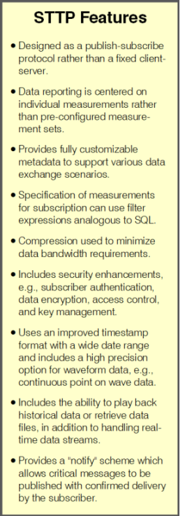
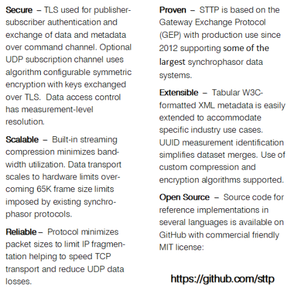
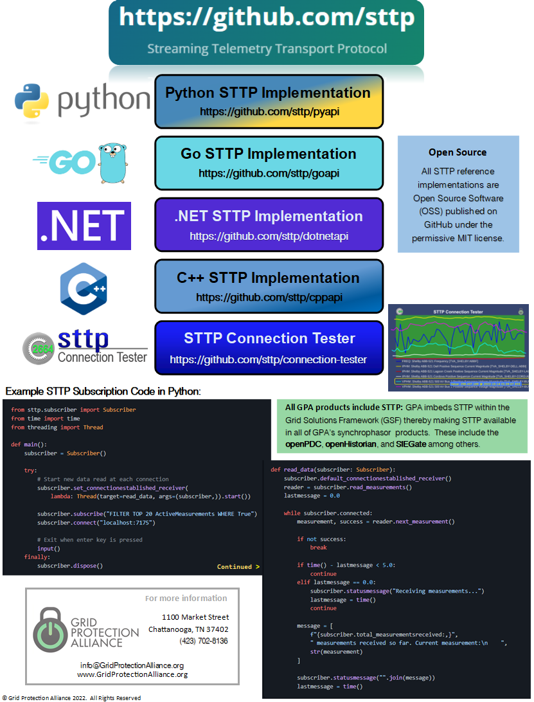

<!-- This markdown page is separate from GitHub Pages home page -->

    

The Streaming Telemetry Transport Protocol (STTP) is optimized for the demands of transporting high volume continuous streaming data and related metadata.
The protocol allows for the transmission of any information that can be represented longitudinally, e.g., time-series data.

STTP is currently undergoing IEEE standardization [(P2664)](https://standards.ieee.org/ieee/2664/7397/).

<a href="#documentation">Documentation</a>

 
 

 
 

# Documentation

## Topics

* [Filter Expressions](filter-expressions)
* [Data Sets](data-sets)
* [Reverse Connections](reverse-connections)
* [Mutual Subscriptions](mutual-subscriptions)
* [High-Throughput with VM](vm-with-high-throughput)

 

    

