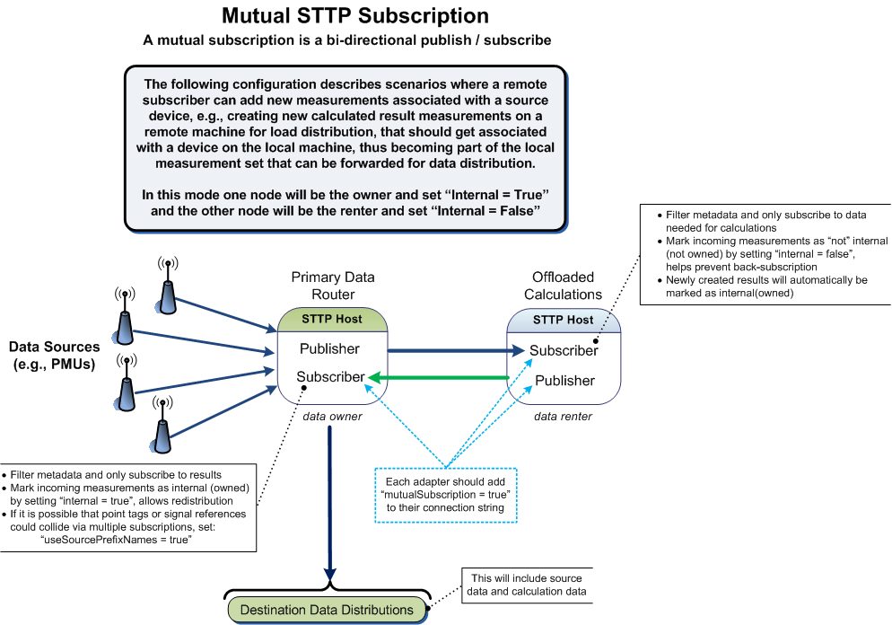

# Mutual Subscriptions

In STTP a common scenario exists where two parties mutually send and receive data. This bi-directional publish and subscribe operation is called a _mutual subscription_.

Typically mutual subscription process includes the exchange of available metadata that each party has to offer, followed by a subscription to the desired data. Commonly the subscribing parties will "merge" the local and remote metadata datasets together creating a conflated set of all data available for redistribution to internal systems. The merge operation is made possible because metadata is uniquely keyed with UUID values. In a mutual subscription mode, it is always important to distinguish data received from a remote party from data that was collected internally, i.e., establishing the notion of data ownership.

## Data Ownership

The default metadata set for measurements includes an `Internal` flag which is used to indicate ownership of a measurement. Setting this flag to `true` means that a measurement is safe for redistribution, whereas setting the flag to `false` means the measurement should not be included with metadata provided to other parties, i.e., it is intended for internal use only.

The most simple use case for metadata mergers is to simply set the `Internal` flag to `false` for any received metadata in a mutual subscription. Scenarios are easily imagined, however, where a central party may be responsible for data distribution to and from multiple parties, e.g., a hub and spoke approach to data distribution. In this scenario the hub would always set received metadata `Internal` flag to `true`, but the spokes would always set the `Internal` flag to `false`. In this hub and spoke approach, if data ownership is needed at the spoke to for easier internal redistribution, then a second subscription can be setup to receive all data from the spoke and mark the received data as owned.

> :information_source: All this is simple enough as a concept, but the actual implementations can often be more complex than they first appear, e.g., when the metadata merge process results are stored in a database. For example, data merge operations should be careful to not overwrite received measurement metadata with a UUID that is already locally owned. The remote party may have renamed the measurement for its own purposes and accidentally provided the measurement back, having taken ownership of the value.

## Calculation Load Distribution

One common scenario exists where a system is receiving incoming values and calculating new results that become part of the local data set so that the original measurements and the new result measurements can be forwarded along together. If the calculation is particularly onerous, the calculation can be moved onto an independent machine where the original machine and the machine hosting the calculation can be setup in a mutual subscription so that the work of the calculation can be offloaded for CPU load distribution. In this scenario, as shown in [Figure 1](#figure-1), the primary system is considered the _data owner_ and the calculation system is considered the _data renter_.

##### Figure 1

