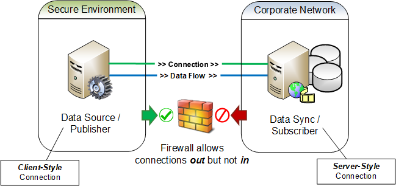

# Reverse Connections

In STTP it is perfectly valid for a publisher to initiate a client-style socket connection to a subscriber that is listening with an established server-style socket. This type of connectivity model is called a _reverse connection_. Since a client-style connection is the only type of socket that can initiate a connection, a reverse connection requires the publisher to be the initiator of a connection such that the target subscriber would be able to receive data.

Reverse connections flip the normal responsibilities of a publish/subscribe messaging pattern by having parties that provision the data also the be the initiators of a connection. Data subscribers, which might otherwise come and go as needed, now become a persistent network resource that needs to be readily available for a connection from its publisher. Reverse connections can require more data flow planning and network engineering to ensure that connections are initiated from the proper locations while having the data reliably flow to the desired locations.   Most often a _reverse connection_ is used to ensure connection is initiated from a environment of higher security to one of a lower security as is cyber security and NERC CIP best practice.

Figure 1

Regardless of how a connection is established, forward or reverse, the functions, roles and responsibilities of the participants will not change, i.e., a publisher shall still be the provider of data and the subscriber shall still be the consumer of data. Additionally, any required protocol negotiations by the parties continues as normal once the connection has been established.

> :information_source: Increased flexibility in the connectivity models for STTP is necessary so that security boundaries that have been enforced with firewall rules can be maintained. A common use case is that the publisher, and the data it is has access to, will exist in a secure network environment and the subscribers, which need access to the data, will exist in less secure network environments. In these scenarios, firewall rules will prohibit any connections to be initiated from an environment that is considered to be less secure. However, such environments normally allow connections to be initiated from inside the secure environment out to listening connections in less secure environments, see [Figure 1](#user-content-figure1). Described more simply, nothing can reach in to systems in the secure environment, but systems in the secure environment can reach out - this is much like how a computer in a home network can access the public Internet through a router, but the router's built-in firewall prevents systems on the Internet from accessing the home computer. Although reverse connections may initially seem counter-intuitive, they exist as a firm STTP requirement to allow for successful data exchange from within secure environments.
